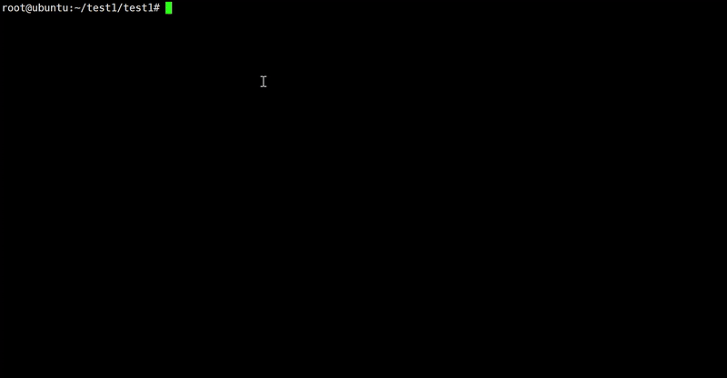

# Withefuck

[English](./README.en.md) | [中文](./README.md)

Inspired by [nvbn/thefuck](https://github.com/nvbn/thefuck), Withefuck leverages Large Language Models (LLMs) to fix mistyped shell commands automatically. No rule sets to maintain, supports multi-round corrections with recent context.

- Advantage 1: No manual rule maintenance
- Advantage 2: Uses multiple recent commands to infer your real intent

Supports bash and zsh for now.

## Quick Start

```bash
cd /opt
git clone https://github.com/handsome-Druid/Withefuck.git
cd Withefuck
chmod +x ./install.sh
./install.sh
```

### Build the Rust version (optional but recommended)

If you have Rust installed, you can build the native binary and let the shell wrapper use it automatically:

```bash
cargo build --release
sudo cp target/release/wtf /usr/local/bin/wtf
```

The wrapper `wtf.sh` will prefer `/usr/local/bin/wtf` if present, and fall back to the Python scripts otherwise.

## Usage

### Single-turn fix


### Multi-turn fix



## Upgrade

~~~bash
wtf --uninstall
rm -rf /opt/Withefuck
~~~

Then git clone and install again.