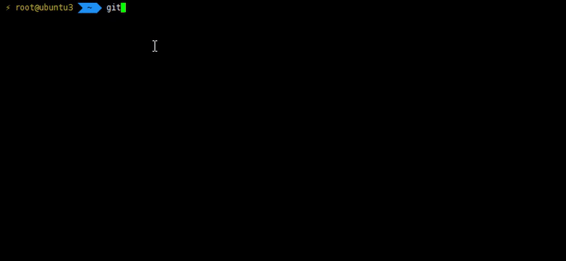
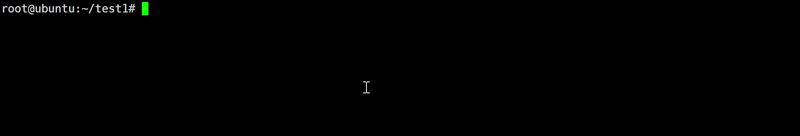
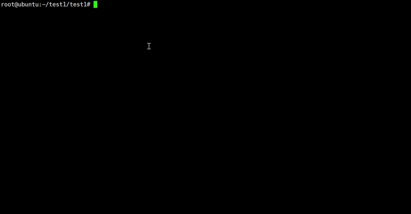

# Withefuck

[English](./README.en.md) | [中文](./README.md)

受 [nvbn/thefuck](https://github.com/nvbn/thefuck) 启发，Withefuck 使用大语言模型（LLM）自动修正你在终端输入的错误命令，无需手动维护规则库，开箱即用，支持多轮修正。

- 优势 1：无需手动维护配置规则，减少心智负担
- 优势 2：可参考最近多条命令历史，自动推断你的真实意图

目前支持bash和zsh

## 快速开始

```bash
cd /opt
git clone https://github.com/handsome-Druid/Withefuck.git
cd Withefuck
chmod +x ./install.sh
./install.sh
```



## 使用方法

### 单次修正




### 多轮修正




## 如何升级

~~~bash
wtf --uninstall
rm -rf /opt/Withefuck
~~~

然后重新下载安装